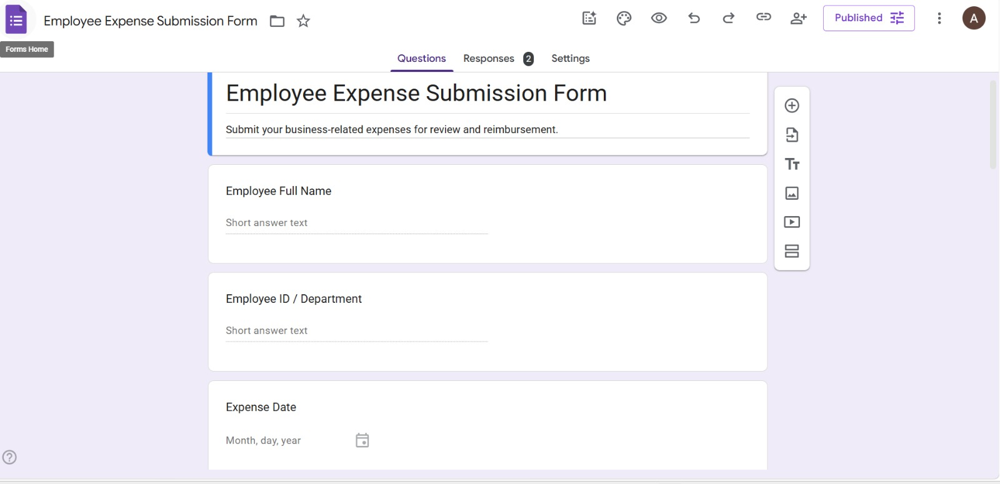
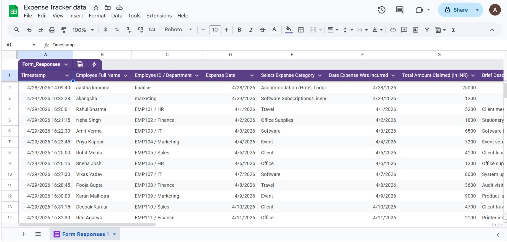
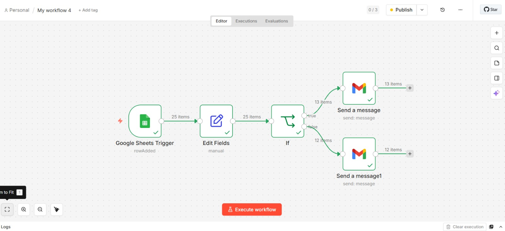

# 💼 Finance Expense Automation System

## 🚀 Overview
This project presents an automated expense management system designed to improve efficiency, accuracy, and real-time visibility in financial operations.

It demonstrates how modern automation tools can replace manual expense tracking processes with a streamlined, technology-driven workflow.

---

## 🎯 Objective
To design and implement an automated system that:

- Captures employee expense data efficiently  
- Reduces manual intervention in financial processes  
- Enables real-time tracking and monitoring  
- Supports data-driven decision-making  

---

## 🎯 Problem Statement
Traditional expense management systems in organizations often face:

- Manual data entry and processing delays  
- High probability of human errors  
- Lack of transparency and real-time insights  
- Inefficient tracking and reporting mechanisms  

---

## 💡 Proposed Solution
The system automates the complete expense lifecycle:

1. Employee submits expense via Google Form  
2. Data is automatically stored in Google Sheets  
3. n8n workflow detects new entry and processes data  
4. Instant email notification is generated  
5. Data is made available for dashboard-based analysis  

---

## 🏗️ System Architecture
Google Form → Google Sheets → n8n → Email Notification → Power BI Dashboard  

---

## 🛠️ Tools & Technologies Used

- **n8n** – Workflow Automation  
- **Google Forms** – Data Collection  
- **Google Sheets** – Data Storage  
- **Gmail** – Email Notification System  
- **Microsoft Power BI** – Data Visualization and Analytics  

---

## 📸 System Screenshots

### 📝 Google Form

### 📊 Google Sheet Data

### ⚙️ n8n Workflow

### 📧 Email Notification

---

## ⭐ Key Features

- Automated expense data capture  
- Real-time workflow execution  
- Instant email notifications  
- Centralized data storage  
- Structured and scalable system design  
- Dashboard-ready dataset for analysis  

---

## 📈 Business Relevance

- Enhances operational efficiency in finance teams  
- Reduces administrative workload  
- Improves accuracy and consistency in data handling  
- Enables real-time monitoring of expenses  
- Supports informed financial decision-making  

---

## 🧠 Use Cases

- Corporate expense management systems  
- Financial reporting and analysis  
- Small and medium enterprise (SME) operations  
- Shared service finance centers  

---

## 🔮 Future Scope

- Integration of approval workflows  
- Role-based access control mechanisms  
- AI-based expense classification and insights  
- Integration with ERP and accounting systems  
- Automated dashboard refresh and reporting  
- Fraud detection using advanced analytics  

---

## 📌 Conclusion

This project highlights the practical application of automation in finance, demonstrating how digital tools can transform traditional processes into efficient, transparent, and intelligent systems.
